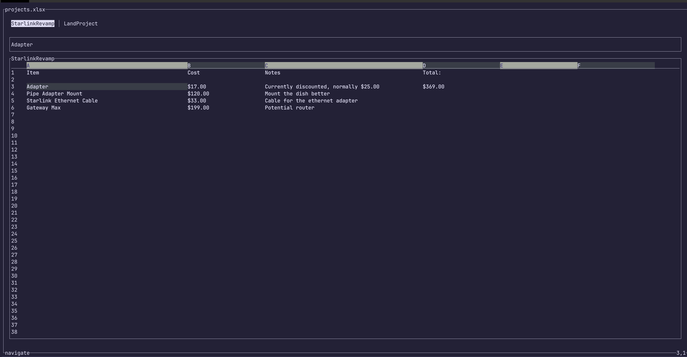

# SheetsUI - a console based spreadsheet application

## Installing

### Nix Flake

```sh
nix profile install github:zaphar/sheetsui
```

### Cargo

```sh
cargo install --git https://github.com/zaphar/sheetsui --locked
```

## Running

```sh
sheetui --help #print the help text for the cli

Usage: sheetui [OPTIONS] <WORKBOOK>

Arguments:
  <WORKBOOK>

Options:
  -l, --locale-name <LOCALE_NAME>      [default: en]
  -t, --timezone-name <TIMEZONE_NAME>  [default: America/New_York]
  -h, --help                           Print help
  -V, --version                        Print version
```

```sh
sheetui path/to/file.xlsx # edit/view a spreadsheet
```

### Supported files

Currently we only support the [ironcalc](https://docs.ironcalc.com/) xlsx
features for spreadsheet. CSV import and expor are planned.

### Screenshot



## Reference

* [Documentation](./docs/index.md)
